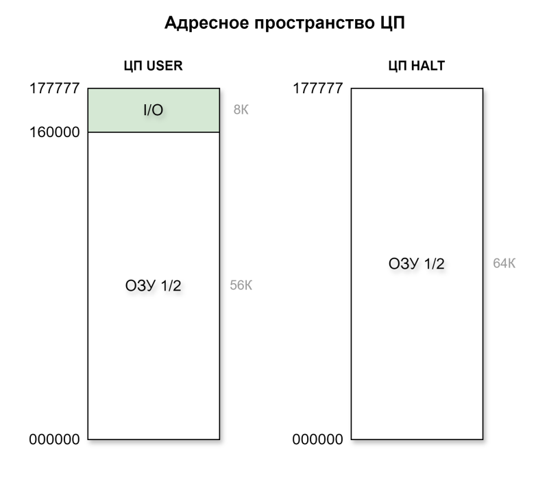
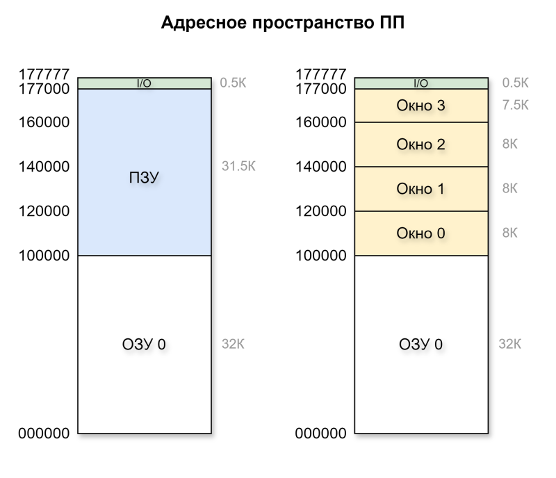
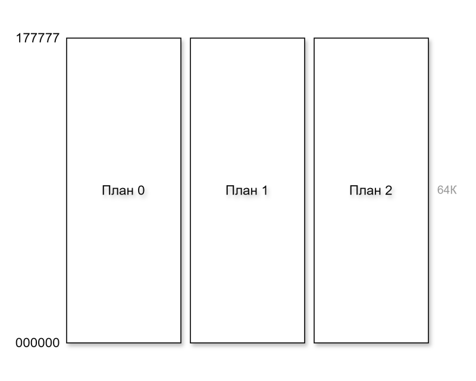
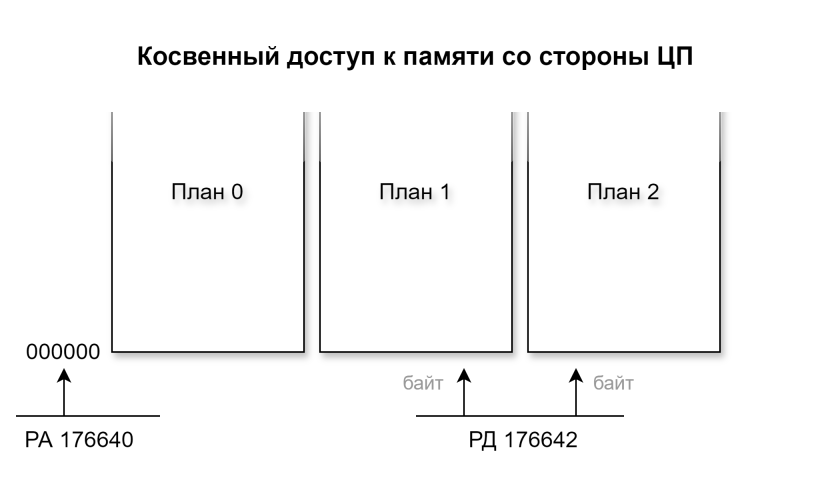
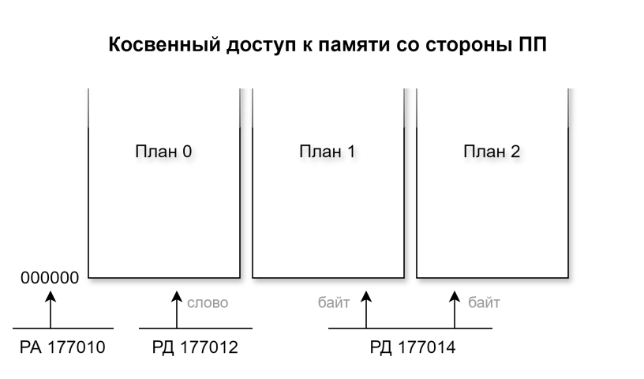

# Устройство памяти УКНЦ

Давайте поговорим про устройство памяти УКНЦ. Тема важная и вокруг неё возникает много вопросов.

По структуре своей памяти УКНЦ мало похожа на какой-либо из других советский компьютеров или других PDP-11.
Так получается потому, что в основу структуры памяти положено разбиение на три "плана": 0/1/2. И сделано это таким образом в угоду "видео-адаптеру" УКНЦ.
В каждом плане памяти расположено 64Кбайт, все три плана ОЗУ УКНЦ имеют суммарно 192Кбайт.

Видео-адаптер регулярно обращается к памяти, и выбирает по 24 бита = 3 байта за раз, по одному байту из каждого слоя памяти.
Тройка бит (где каждый бит взят из своего плана) даёт один из восьми цветов, которым изображается точка на экране.
Выбранные 24 бита = 3 байта формируют на экране 8 точек.

Дальше, кроме видео-адаптера с памятью также работают центральный процессор (ЦП) и периферийный процессор (ПП).
Слова в оперативной памяти центрального процессора формируются из пар байтов планов 1 и 2.
Оперативная память периферийного процессора формируется из байтов 0-го плана.

Память всех планов можно условно поделить на "нижнюю", которая используется процессорами как оперативная память, и "верхнюю", которая используется для хранения данных строк, показанных на экране.

## Адресное пространство ЦП



В слова ОЗУ, доступные для ЦП, эти планы собраны побайтно. То есть, например, по адресу 000000 в памяти ЦП находится слово, в котором один байт из плана 1, второй байт из плана 2.

Планы 1 и 2 суммарно имеют объём в 128К байт.
Но ЦП может адресовать только 64К байт. Для ЦП в режиме USER ОЗУ доступно до адреса 160000, в режиме HALT до адреса 177777.

В самом конце адресного пространстваа (как это по традиции делается в PDP-11 машинах) расположены "регистры" — "порты" устройств, спроецированные на память. Страница ввода-вывода доступна ЦП только в режиме USER.

Получается, что из всех 128К байт ОЗУ планов 1 и 2, для ЦП полноценно доступно только 64К байт. "Верхняя" часть этих планов обычно хранит строки, изображаемые на экране.

## Адресное пространство ПП



Для ПП слова оперативной памяти собираются из байт 0-го плана памяти. Причём, обращение к этой памяти происходит дважды, поскольку доступ к памяти 8-разрядный.

ПП видит только 32К ОЗУ плана 0, спроецированные на адреса 000000-077777. Остальные 32К байт памяти плана 0 — это "верхняя" память, предназначенная для хранения строк, изображаемых на экране.

Итак, "нижние" 32К адресов ПП заняты под ОЗУ.
Верхние 512 байт памяти ПП (177000-177777) занимают "регистры" внешних устройств. Остальные 31.5К байт адресного пространства ПП (100000-176777) могут переключаться.

В адресах 100000-176777 (32К) находится системное ПЗУ — с него, в частности, происходит начальная загрузка компьютера при включении питания.

По адресам 100000-117777 (8К) находится "Окно 0", в которое может быть включено:
 - ПЗУ
 - ОЗУ плана 0
 - память картриджа 1 либо 2

Далее расположены ещё три окна:
 - 120000-137777 (8К) — окно 1
 - 140000-157777 (8К) — окно 2
 - 160000-176777 (7.5К) — окно 3

В каждое из этих окон постоянно включено ПЗУ, плюс ещё может быть включено ОЗУ плана 0.
При включении ОЗУ в этих окнах, ПЗУ не отключается и два вида памяти конкурируют за общую шину.
При чтении отвечают оба устройства, и результат складывается по ИЛИ. ПЗУ отвечает быстрее, но контроллер ПП сразу же выставляет на шину свой буферный регистр, в котором успевает обновиться только младший байт. В результате, по ИЛИ складывается с одной стороны результат из ПЗУ, с другой стороны — старший байт от предыдущего чтения ОЗУ и младший байт текущего чтения ОЗУ.
При записи ПЗУ не делает ничего, в ОЗУ записываются данные как обычно.

Таким образом, механизм "окон" позволяет ПП ограниченно работать с "верхней" памятью плана 0: по адресам 100000-117777 (окно 0) полноценно, по адресам 120000-176777 (окна 1-3) только по записи.
Также это означает, что работая с ОЗУ через окна 1-3 нельзя использовать байтовые операции и операции с циклом "чтение-модификация-запись", такие как BIC/BIS.

В самом конце памяти ПП (177000-177777) расположена страница ввода-вывода с регистрами устройств.

## Косвенный доступ к оперативной памяти



Процессоры могут обращаться к ОЗУ (и ПЗУ) напрямую, в том случае когда эта память включена в адресное пространство процессора. Помимо этого, УКНЦ предоставляет доступ ко всему объёму памяти (включая "верхнюю" память) через механизм косвенного (регистрового) доступа.



Для ЦП косвенный доступ предоставляется через регистры 176640 (адрес) и 176642 (данные).
Работает это так: выставляем адрес в регистр 176640. При чтении из регистра 176642, данные читаются непосредственно из ОЗУ: старший байт из плана 2, младший байт из плана 1. При записи в 176642, байты записываются в ОЗУ: старший байт в план 2, младший байт в план 1.


```
       │  План 0    ││  План 1    ││   План 2   │
       │            ││            ││            │
       │            ││            ││            │
       │            ││            ││            │
       │            ││            ││            │
000000 └────────────┘└────────────┘└────────────┘
   │           │              │        │
──────────   ─────────────  ─────────────
РА 177010      РД 177012      РД 177014
```

Для ПП косвенный доступ работает через регистры 177710 (адрес), 177712 (план 0) и 177714 (планы 1 и 2). Опять же, при изменении значения в регистре 177710, сразу читается байт плана 0 в регистр 177712, и байты планов 1 и 2 в регистр 177714. По записи в регистр 177712 пишется байт в план 0. По записи в регистр 177714 пишутся байты в планы 1 и 2.

Важный момент по работе с регистрами косвенной записи ПП: данные _читаются_ в регистры данных только по записи в регистр адреса. Чтение из регистров данных косвенной записи — это чтение из регистров. Если вы хотите ещё раз прочитать актуальные данные именно из памяти, то нужно ещё раз записать в регистр адреса, даже если это тот же самый адрес.

Таким образом, получается, что работая через ЦП, мы можем управлять всей памятью планов 1 и 2. То есть, при работе с изображением (с памятью экранных строк) мы можем работать в четырёх цветах.
При работе через ПП нам доступна уже вся память всех планов. Это позволяет работать с изображением в восьми цветах.
